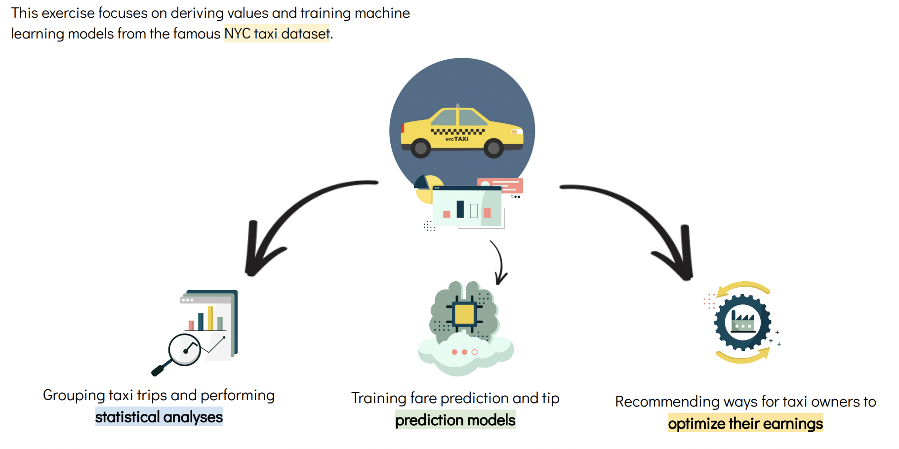

# NYC Taxi Analysis

This project focuses on the analysis of the famous NYC taxi dataset. 

It is entirely done on a Jupyter Notebook `NYC.ipynb`

The motivation of the project as well as the insight gained can be accessed in a Google Slides format by clicking on this [link](https://docs.google.com/presentation/d/1nFowM63-fCoBtXVkmLWWV0zPij7VZZ9j94-1VHuh89M/edit#slide=id.g105353014c9_0_310)
